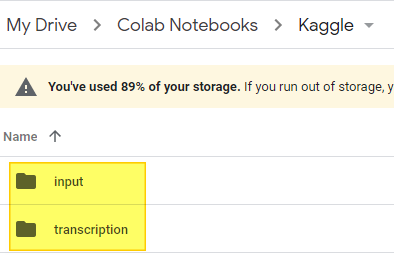

# Google Colaboratory

## Google Colaboratory

* URL - https://colab.research.google.com/
* 사용하기 - https://velog.io/@s6820w/colab1

## 구글 드라이브 디렉토리 구조

* input
  * train, test 데이터셋 저장
* transcription
  * Jupyter Notebook 파일 저장



## Colab에서 구글 드라이브 마운트 하는 방법

```python
from google.colab import drive
drive.mount('/content/gdrive')
```


## 현재/작업 디렉토리를 Notebook 저장 디렉토리로 이동

```python
%cd "/content/gdrive/MyDrive/Colab Notebooks/Kaggle/transcription"
```


## 데이터셋 확인

```python
!ls ../input
```

